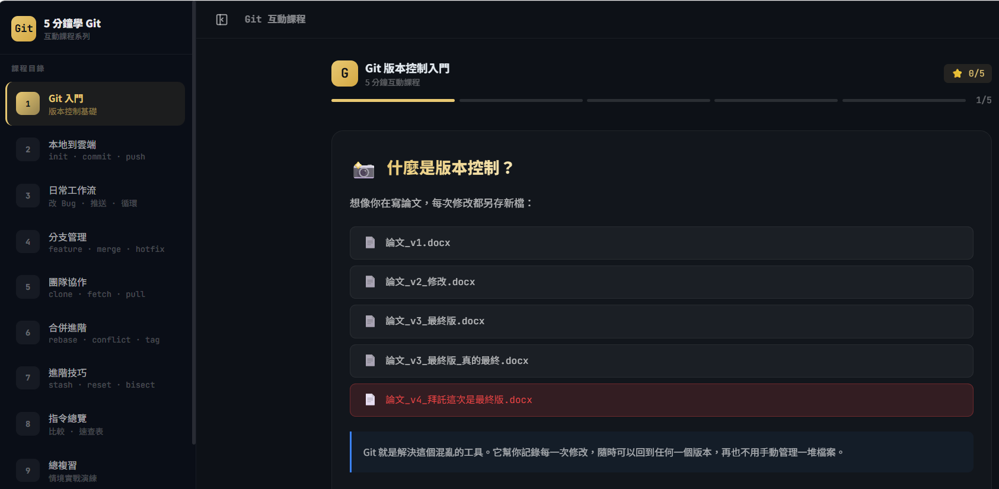

# 5 Minutes Git — 互動式 Git 入門課程

**在瀏覽器裡打 `git commit`，不用怕搞壞任何東西。**

專為「會寫一點程式、但從沒碰過版本控制」的人設計的 10 堂互動課程。不用背指令——每一步都在解決一個你真的會遇到的問題。



## 為什麼做這個？

大部分 Git 教學不是要你讀一整本書，就是丟一堆指令叫你背。我們反過來——從「你剛做完一個專案，怕改壞又不敢亂動」這個真實場景出發，讓你在模擬終端機裡親手打指令、即時看結果，搞懂每個指令到底在幹嘛。

## 課程特色

🖥️ **互動式模擬終端機** — 在安全環境裡動手練習，打錯了會提示你哪裡不對，不會搞壞任何東西

📖 **情境驅動，不是指令清單** — 每堂課從一個具體問題開始：「怎麼把專案推上 GitHub？」「同事改了同一個檔案怎麼辦？」

📝 **命名規範融入實作** — branch 怎麼命名、commit message 怎麼寫，直接在練習中學會，不是另外開一頁叫你背

📈 **難度曲線經過設計** — 從個人使用到團隊協作，10 堂課層層遞進，不會突然跳級

🔍 **Git 速查表** — 隨時可開啟的浮動面板，涵蓋 8 大類常用指令 + Conventional Commit Type 規範，支援關鍵字搜尋與一鍵複製

## 課程大綱

| 堂數 | 主題 | 重點 |
|:----:|------|------|
| 1 | Git 入門 | 版本控制概念、三個空間、基本指令 |
| 2 | 本地到雲端 | init · commit · push 完整流程 |
| 3 | 日常工作流 | 改 Bug · 推送 · 日常循環 |
| 4 | 分支管理 | feature branch · merge · hotfix |
| 5 | 團隊協作 | clone · fetch · pull · 協作流程 |
| 6 | 合併進階 | rebase · conflict 處理 · tag |
| 7 | 進階技巧 | stash · reset · bisect |
| 8 | 觀念澄清 | 易混淆指令對比、情境決策矩陣 |
| 9 | 總複習 | Git Flow、情境實戰演練 |
| 10 | 實戰演練 | 從零到 GitHub 的三日旅程 |

## 快速開始

```bash
git clone https://github.com/hui0315/5-minutes-lesson.git
cd 5-minutes-lesson/Git/my-react-app
npm install
npm run dev
```

## 跟其他 Git 教學有什麼不同？

| | 文字教程 | 影片課程 | Learn Git Branching | **本課程** |
|---|---|---|---|---|
| 動手練習 | ❌ | ❌ | ✅ | ✅ |
| 完整工作流 | ✅ | ✅ | ❌ | ✅ |
| 即時回饋 | ❌ | ❌ | ✅ | ✅ |
| 繁體中文 | 少 | 少 | ❌ | ✅ |
| 情境驅動 | ❌ | 部分 | ❌ | ✅ |

## Tech Stack

React · React Router · Framer Motion · Vite

## License

MIT
